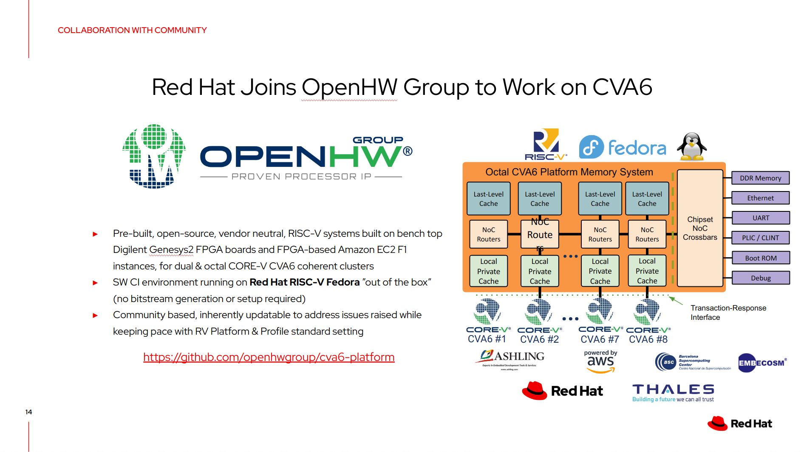
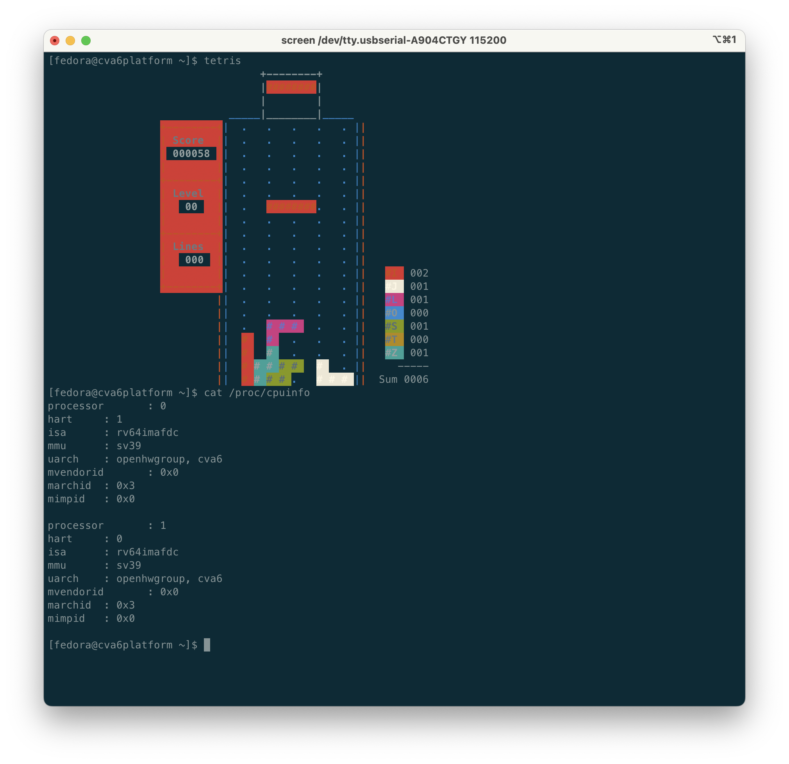

# CVA6 Platform

CVA6 Platform is a multi-core CVA6 with CV-MESH intended for software testing and regression.

## Genesys II: Getting Started

1. Download the pre-built bitstream from [downloads.openhwgroup.org](https://s3.eu-west-1.amazonaws.com/downloads.openhwgroup.org/cva6/20231104-4-uboot-g2-2c.bit).
2. Put it on a FAT32 formatted USB stick.
3. Insert the USB stick into the top USB port on the Genesys II board. Set the JP5 to switch to USB/SD and JP4 to USB, this will use the bitstream on the pendrive (more detailed instructions can be found [here](https://digilent.com/reference/programmable-logic/genesys-2/reference-manual#usb_host_and_micro_sd_programming)).
4. Download the Fedora image from [downloads.openhwgroup.org](https://s3.eu-west-1.amazonaws.com/downloads.openhwgroup.org/cva6/summit_fedora_20231104_2.img.gz).
5. `gunzip` and flash the image on an SDCard using [BalenaEtcher](https://etcher.balena.io/).
6. Power on the board and play `tetris`.

## Build instructions for Genesys2

### General Overview:

1. Compile bitstream
2. Generate fw_payload.bin
3. Build Linux
4. Copy fw_payload.bin and Image into /boot/
5. Boot Linux

Detailed Look:

0. Initialization
We assume you have a xpack-riscv-none-embed prebuilt riscv cross-compiler installed in `~/tools/` and have

`export RISCV_TOOLCHAIN=$HOME/tools/xpack-riscv-none-embed-gcc-10.2.0-1.2`
`export PATH=$PATH:$RISCV_TOOLCHAIN/bin`

in your .bashrc.

1. Compiling Bitstream

To compile the bitstream, clone the openpiton repo (openpiton-dev branch) and then

`git clone git@github.com:PrincetonUniversity/openpiton.git -b openpiton-dev`
`cd openpiton`

Make sure the necessary submodules are updated using:

`git submodule update --init --recursive piton/design/chip/tile/ariane`
`git submodule update --init --recursive piton/design/chipset/rv64_platform/bootrom/u-boot/uboot`

Navigate to the openpiton directory and run

`export PITON_ROOT=$PWD`
`export ARIANE_ROOT=$PITON_ROOT/piton/design/chip/tile/ariane`
`source piton/piton_settings.bash`

Then run source your Vivado setup, e.g.:

`source /tools/Xilinx/Vivado/2022.1/settings64.sh`

Generate the bitstream with

`protosyn -b genesys2 -d system -c ariane --x_tiles=2 --y_tiles=1 --linux_bootrom=uboot`

2. Generating fw_payload.bin

Navigate to `./piton/design/chipset/rv64_platform/bootrom/u-boot/uboot`.

Run `make distclean`.

Apply the non-spl defconfig using `make ARCH=riscv CROSS_COMPILE=riscv-none-embed- openpiton_riscv64_defconfig`.

Re-build `u-boot-nodtb` using `make ARCH=riscv CROSS_COMPILE=riscv-none-embed- -j8`.

Clone opensbi 1.0 to your preferred directory using:

`git clone git@github.com:riscv-software-src/opensbi.git`
`cd opensbi`
`git checkout v1.0`
`ARCH=riscv CROSS_COMPILE=riscv-none-embed- make PLATFORM=fpga/openpiton FW_PAYLOAD_PATH=$PITON_ROOT/piton/design/chipset/rv64_platform/bootrom/u-boot/uboot/u-boot-nodtb.bin`

3. Building Linux

`git clone git@github.com:openpiton/linux.git -b cva6platform-6.2`

Here we assume you'll use the committed .config for your build.

Build the kernel using `make ARCH=riscv CROSS_COMPILE=riscv-none-embed- -j8` (assuming you want to use 8 threads).

4. Copying into SD card

First, mount the SD card. Run `lsblk` to find out the name of the disk's first partition, e.g. `/dev/sdb1` but please be very careful and double and triple check. Then, run e.g. `sudo mount /dev/sdb1 mntdir/` where `mntdir/` is the name of an empty directory. Alternatively if your distro automounts the SD, you can just move on to copying the files below.

Copy `arch/riscv/boot/Image` (from your linux build) and `build/platform/fpga/openpiton/firmware/fw_payload.bin` (from your opensbi build) into `mntdir/boot/` of the SD card, and run `sync` to ensure the data is copied properly, and then run `sudo umount mntdir/` to safely remove the SD card.

Copy your `build/genesys2/system/genesys2_system/genesys2_system.runs/impl_1/system.bit` (from your openpiton build) onto a USB drive for programming the FPGA.

5. Boot

Plug the USB into the top USB port and insert the SD card and boot up the FPGA.